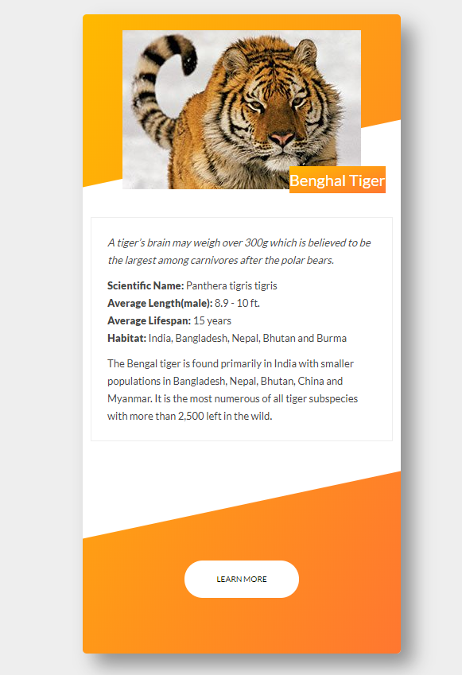

# Animal Trading Cards
[Udacity Front End Web Developer NanoDegree](https://www.udacity.com/course/front-end-web-developer-nanodegree--nd001)



This project was completed as part of the Udacity Front End Web developer nanodegree program and is based off of the [design prototype](./design-prototype.png) provided.

## Getting Started
* Clone the repo
* Install dependencies

```sh
npm install
```

* Start the project

```sh
npm start
```

## Contributing

This project was completed as part of a nanodegree project and as such I will not be accepting any pull requests.

## License

This project is controlled by the [MIT license](./LICENSE) and is free for anyone to use and build off of.
